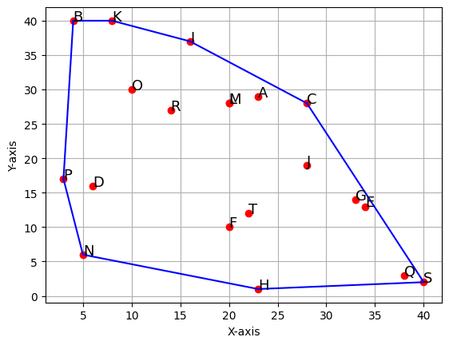
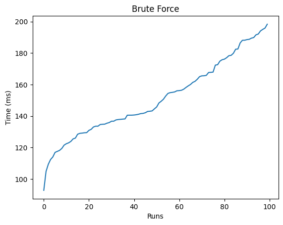
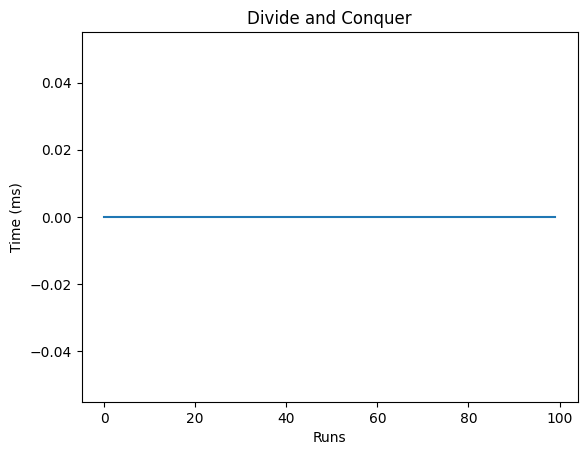

# Convex Hull Implementation

This repository contains a Python implementation of two algorithms for computing the convex hull of a set of points in 2D space: the brute-force method and the divide-and-conquer approach. The project also includes visualization capabilities and performance comparisons between the two methods.

## Project Overview

The convex hull of a set of points is the smallest convex polygon that contains all the points. This implementation provides:

1. **Brute-force convex hull algorithm** - A straightforward approach that checks all possible line segments  
2. **Divide-and-conquer convex hull algorithm** - A more efficient strategy based on recursive partitioning  
3. **Visualization** - Using matplotlib to plot points and their convex hull  
4. **Performance analysis** - Comparing execution times of both methods  

## Implementation Details

### Core Components

- **Node and DoublyLinkedList classes**:  
  - Store point coordinates and labels  
  - Implement merge sort, split, and display functions needed for the divide-and-conquer method  
  - Contain the convex hull algorithms  

- **Plot class**:  
  - Visualizes the points and computed convex hull using matplotlib  
  - Labels points with letters for easy identification  

### Algorithms

1. **Brute Force**:
   - Checks all possible line segments between points  
   - Determines if all other points lie on one side of the segment  
   - Time complexity: O(n³)


---
2. **Divide and Conquer**:
   - Recursively splits the point set and merges partial solutions  
   - More efficient with time complexity of O(n log n)



### Performance Testing

The implementation includes time tests to compare the performance of both algorithms, measuring:  
- Average execution time  
- Best-case and worst-case scenarios  
- How performance scales with increasing number of points  

## Example Usage

```python
dll = DoublyLinkedList()
[dll.append(np.random.randint(1, 41, size=2)) for _ in range(20)]
print(dll)
Plot(dll)
